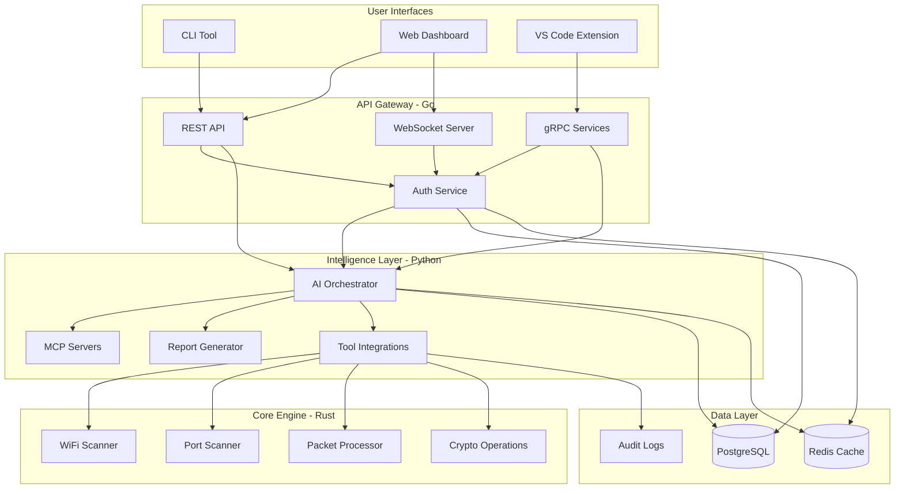
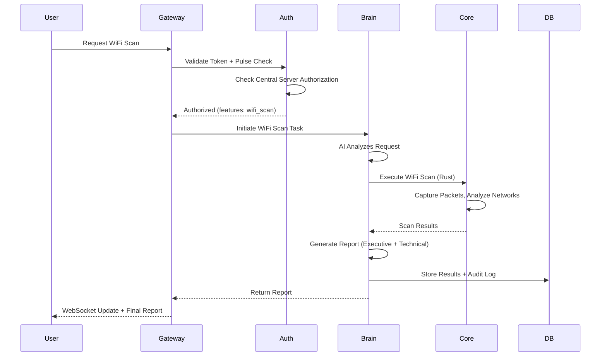
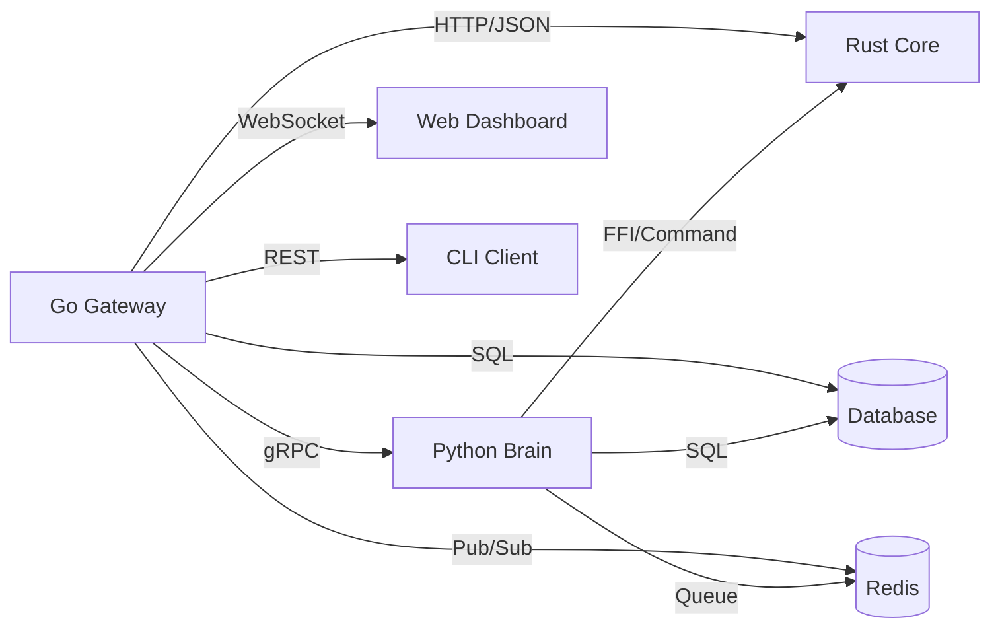

# Cybersecurity Agent - Comprehensive Architecture

> [!CAUTION]
> **Legal & Ethical Use Only**
> This tool is designed for authorized security testing only. Unauthorized access to computer systems and networks is illegal. Users must comply with all applicable laws and regulations.

## 📋 Table of Contents
- [Project Overview](#project-overview)
- [Technology Stack](#technology-stack)
- [System Architecture](#system-architecture)
- [Component Details](#component-details)
- [Security & Compliance](#security--compliance)
- [Deployment Models](#deployment-models)
- [Development Roadmap](#development-roadmap)

---

## 🎯 Project Overview

### Purpose
A comprehensive, AI-driven cybersecurity platform that provides:
- **Threat Detection & Monitoring** - Real-time security monitoring and anomaly detection
- **Vulnerability Assessment** - Automated scanning and penetration testing
- **Incident Response & Forensics** - Investigation and analysis capabilities
- **Security Automation** - Orchestrated security operations
- **WiFi Security Testing** - Network security assessment capabilities

### Key Capabilities
1. **Offensive Security**: Penetration testing, vulnerability exploitation, WiFi cracking
2. **Defensive Security**: Threat monitoring, intrusion detection, security hardening
3. **Forensics**: Log analysis, incident investigation, timeline reconstruction
4. **Cloud Security**: AWS/Azure/GCP security auditing and compliance
5. **Web Security**: OWASP Top 10 testing, API security assessment
6. **Network Security**: Port scanning, service enumeration, network mapping

### Target Environments
- Web applications and APIs
- Network infrastructure
- Cloud environments (AWS, Azure, GCP)
- Local systems and endpoints
- IoT devices
- WiFi networks

### Enterprise Features (Phase 2-3)
- **Multi-Tenancy**: Organizations with row-level security
- **RBAC**: Owner, Admin, Scanner, Viewer roles
- **Compliance**: Cryptographic audit signing (Ed25519)
- **Authorization Workflow**: Permission to Scan with document verification
- **Emergency Controls**: Platform-wide kill switch
- **Production Infrastructure**: Kubernetes with auto-scaling
- **Observability**: Prometheus metrics and structured logging

---

## 🛠️ Technology Stack

### Polyglot Architecture Rationale

We use **multiple languages** optimized for specific tasks:

| Component | Language | Rationale |
|-----------|----------|-----------|
| **Core Engine** | Rust | Memory safety, zero-cost abstractions, fearless concurrency, native performance |
| **Service Layer** | Go | Excellent concurrency, built-in networking, fast compilation, goroutines |
| **Intelligence Layer** | Python | Rich AI/ML ecosystem, security tool integration, rapid development |
| **Frontend** | TypeScript/React | Type safety, modern UI framework, real-time updates |

### Language Distribution
- **40% Python** - AI orchestration, tool integration, MCP servers
- **30% Rust** - Performance-critical scanning and packet processing
- **20% Go** - API gateway, real-time services, authentication
- **10% TypeScript** - Web dashboard and VS Code extension

### Key Dependencies

#### Rust Core (`cyper-core`)
- `tokio` - Async runtime
- `pnet` / `libpnet` - Packet manipulation
- `pcap` - Packet capture
- `rayon` - Data parallelism
- `serde` - Serialization/deserialization
- `openssl` - Cryptographic operations

#### Go Gateway (`cyper-gateway`)
- `gin` / `fiber` - HTTP framework
- `grpc-go` - gRPC services
- `gorilla/websocket` - WebSocket support
- `go-redis` - Caching and pub/sub
- `sqlx` - Database access
- `jwt-go` - JWT authentication

#### Python Brain (`cyper-brain`)
- `anthropic` - AI integration
- `sqlalchemy` - Database ORM
- `celery` - Distributed task queue
- `jinja2` - Report templating
- `scapy` - Packet manipulation
- `requests` - HTTP client
- Security tools: `python-nmap`, `sqlmap`, etc.

#### React Dashboard (`cyper-dashboard`)
- `react` + `react-router-dom`
- `typescript`
- `socket.io-client` - Real-time updates
- `recharts` - Data visualization
- `tailwindcss` - Styling
- `shadcn/ui` - Component library

---

## 🏗️ System Architecture

### High-Level Architecture



### Data Flow



### Component Communication



---

## 📦 Component Details

### 1. Core Engine (Rust) - `cyper-core`

**Purpose**: Performance-critical security operations

**Modules**:

#### WiFi Security Module
```rust
// src/wifi/scanner.rs
pub struct WiFiScanner {
    interface: String,
    capture_filter: Option<String>,
}

impl WiFiScanner {
    pub async fn scan_networks(&self) -> Result<Vec<Network>>;
    pub async fn analyze_security(&self, network: &Network) -> SecurityReport;
    pub async fn test_wpa_strength(&self, network: &Network) -> CrackingDifficulty;
}

// src/wifi/deauth.rs
pub struct DeauthAttack {
    // Only for authorized testing
    authorization_proof: String,
}
```

#### Network Scanner Module
```rust
// src/network/port_scanner.rs
pub struct PortScanner {
    target: IpAddr,
    ports: PortRange,
    scan_type: ScanType, // SYN, Connect, UDP, etc.
}

impl PortScanner {
    pub async fn scan(&self) -> PortScanResults;
    pub async fn service_detection(&self) -> Vec<Service>;
}
```

#### Packet Processing Module
```rust
// src/packet/capture.rs
pub struct PacketCapture {
    interface: String,
    filter: BpfFilter,
}

impl PacketCapture {
    pub async fn start_capture(&mut self) -> PacketStream;
    pub async fn analyze_traffic(&self, packets: Vec<Packet>) -> TrafficAnalysis;
}
```

### 2. Service Layer (Go) - `cyper-gateway`

**Purpose**: API gateway, authentication, real-time services

**Structure**:

#### Authentication Service
```go
// internal/auth/service.go
type AuthService struct {
    db          *sqlx.DB
    redis       *redis.Client
    centralURL  string
    pulseInterval time.Duration
}

func (s *AuthService) ValidateToken(token string) (*User, error)
func (s *AuthService) CheckAuthorization(userID string, feature string) (bool, error)
func (s *AuthService) StartPulseCheck(ctx context.Context)
func (s *AuthService) RevokeSession(sessionID string) error
```

#### Real-time Monitoring
```go
// internal/realtime/hub.go
type Hub struct {
    clients    map[*Client]bool
    broadcast  chan []byte
    register   chan *Client
    unregister chan *Client
}

func (h *Hub) Run()
func (h *Hub) BroadcastScanProgress(scanID string, progress int)
```

#### Audit Logger
```go
// internal/audit/logger.go
type AuditLog struct {
    ID            string
    UserID        string
    Action        string
    Target        string
    Timestamp     time.Time
    Authorization string
    Result        string
    Severity      LogSeverity
}

func LogAction(ctx context.Context, log AuditLog) error
```

### 3. Intelligence Layer (Python) - `cyper-brain`

**Purpose**: AI orchestration, tool integration, reporting

**Structure**:

#### AI Orchestrator
```python
# src/cyper_brain/ai/agent.py
class CyperAI:
    """Main AI orchestration engine"""
    
    def __init__(self, api_key: str):
        self.client = anthropic.Anthropic(api_key=api_key)
        self.context = ConversationContext()
    
    async def analyze_target(self, target: str, scan_type: str) -> ScanPlan:
        """AI creates scan plan based on target"""
        pass
    
    async def interpret_results(self, raw_results: dict) -> Analysis:
        """AI analyzes scan results"""
        pass
```

#### MCP Servers
```python
# src/cyper_brain/mcp/offensive_mcp.py
class OffensiveMCP(MCPServer):
    """MCP server for offensive security tools"""
    
    @mcp_tool()
    async def wifi_crack(self, network: str, method: str) -> dict:
        """WiFi cracking capabilities"""
        pass
    
    @mcp_tool()
    async def exploit_search(self, service: str, version: str) -> list:
        """Search for exploits"""
        pass

# src/cyper_brain/mcp/web_mcp.py
class WebSecurityMCP(MCPServer):
    """MCP server for web application security"""
    
    @mcp_tool()
    async def sql_injection_test(self, url: str, params: dict) -> dict:
        pass
    
    @mcp_tool()
    async def xss_scan(self, url: str) -> dict:
        pass
```

#### Report Generator
```python
# src/cyper_brain/reporting/generator.py
class ReportGenerator:
    """Generate executive and technical reports"""
    
    def generate_executive_summary(self, scan_results: ScanResults) -> str:
        """High-level summary for management"""
        pass
    
    def generate_technical_report(self, scan_results: ScanResults) -> str:
        """Detailed technical findings"""
        pass
    
    def export_pdf(self, report: Report, path: Path) -> None:
        pass
```

### 4. Frontend (TypeScript/React) - `cyper-dashboard`

**Key Components**:

```typescript
// src/components/Scanner/ScannerInterface.tsx
interface ScannerProps {
  scanType: 'wifi' | 'web' | 'network' | 'cloud';
  onScanStart: (config: ScanConfig) => void;
}

// src/services/websocket.ts
class WebSocketService {
  connect(): void;
  subscribeScanProgress(scanId: string, callback: (progress: number) => void): void;
  disconnect(): void;
}
```

---

## 🛡️ Security & Compliance

### Legal Compliance Framework

#### 1. Terms of Use Enforcement

Every user must explicitly accept terms before any functionality is available:

```python
# brain/src/cyper_brain/compliance/terms.py
class ComplianceChecker:
    """Ensure legal compliance before tool usage"""
    
    def require_terms_acceptance(self, user_id: str) -> bool:
        """Force terms acceptance on first run"""
        if not self.has_accepted_terms(user_id):
            self.display_terms()
            self.display_legal_warnings()
            acceptance = self.get_explicit_acceptance()
            self.log_acceptance(user_id, acceptance)
            return acceptance
        return True
    
    def display_legal_warnings(self):
        """Show critical legal warnings"""
        warnings = [
            "⚠️ AUTHORIZATION REQUIRED: Never test systems without explicit written permission",
            "⚠️ LEGAL COMPLIANCE: WiFi interception may be illegal in your jurisdiction",
            "⚠️ CRIMINAL LIABILITY: Unauthorized access is a criminal offense",
            "⚠️ RESPONSIBLE USE: This tool is for authorized security testing only"
        ]
        # Display and require acknowledgment
```

#### 2. Authorization System

**Live Pulse Check**:
```go
// gateway/internal/auth/pulse.go
type AuthorizationPulse struct {
    UserID        string
    SessionID     string
    Features      []string
    ExpiresAt     time.Time
    LastCheck     time.Time
}

func (a *AuthService) StartPulseCheck(ctx context.Context) {
    ticker := time.NewTicker(5 * time.Minute)
    defer ticker.Stop()
    
    for {
        select {
        case <-ticker.C:
            // Check with central authorization server
            status, err := a.validateWithCentralServer()
            if err != nil || !status.Authorized {
                a.RevokeAllSessions()
                a.TriggerKillSwitch()
            }
        case <-ctx.Done():
            return
        }
    }
}
```

**Pre-Scan Authorization Check**:
```python
def require_authorization(feature: str):
    """Decorator to check authorization before any action"""
    def decorator(func):
        @wraps(func)
        async def wrapper(*args, **kwargs):
            user = get_current_user()
            if not auth_service.has_feature(user.id, feature):
                raise UnauthorizedError(f"User not authorized for {feature}")
            
            # Log the authorization check
            audit_log.log({
                'user_id': user.id,
                'feature': feature,
                'action': func.__name__,
                'timestamp': datetime.now()
            })
            
            return await func(*args, **kwargs)
        return wrapper
    return decorator

@require_authorization('wifi_scan')
async def scan_wifi_network(interface: str, network: str):
    """WiFi scanning - requires specific authorization"""
    pass
```

#### 3. Audit Logging

**Comprehensive Activity Tracking**:
```python
# brain/src/cyper_brain/audit/logger.py
class AuditLogger:
    """Track all security-sensitive actions"""
    
    def log_action(self, 
                   user_id: str,
                   action: str,
                   target: str,
                   authorization_proof: str,
                   result: str,
                   severity: str = "INFO"):
        """
        Log format:
        - User ID
        - Action type (scan, exploit, monitor, etc.)
        - Target (IP, domain, network SSID)
        - Authorization proof (session ID, approval document hash)
        - Timestamp
        - Result (success, failure, error)
        - Severity level
        """
        log_entry = {
            'user_id': user_id,
            'action': action,
            'target': target,
            'auth_proof': authorization_proof,
            'timestamp': datetime.utcnow(),
            'result': result,
            'severity': severity,
            'ip_address': get_client_ip(),
            'session_id': get_session_id()
        }
        
        # Write to database
        db.audit_logs.insert(log_entry)
        
        # Also write to append-only log file
        with open(AUDIT_LOG_FILE, 'a') as f:
            f.write(json.dumps(log_entry) + '\n')
```

#### 4. Kill Switch

**Emergency Stop Mechanism**:
```python
# brain/src/cyper_brain/emergency/kill_switch.py
class EmergencyKillSwitch:
    """Immediately terminate all operations"""
    
    def __init__(self):
        self.active_scans = []
        self.active_connections = []
    
    def engage(self, reason: str = "Manual activation"):
        """
        Emergency stop procedure:
        1. Stop all active scans
        2. Close all network connections
        3. Save current state
        4. Generate incident report
        5. Notify administrators
        6. Lock the system
        """
        logger.critical(f"KILL SWITCH ENGAGED: {reason}")
        
        # Stop all running tasks
        for scan in self.active_scans:
            scan.terminate()
        
        # Close all connections
        for conn in self.active_connections:
            conn.close()
        
        # Save state for forensics
        self.save_state()
        
        # Generate incident report
        report = self.generate_incident_report(reason)
        
        # Notify admins
        self.notify_administrators(report)
        
        # Lock system until admin review
        self.lock_system()
```

**Automatic Triggers**:
- Unauthorized access attempt detected
- Authorization pulse check failure
- Detection of illegal activity
- System compromise indicators
- Manual activation

#### 5. Built-in Confirmation Prompts

```python
def require_confirmation(message: str, risk_level: str = "HIGH"):
    """Require explicit user confirmation for risky operations"""
    
    print(f"\n{'='*60}")
    print(f"⚠️  RISK LEVEL: {risk_level}")
    print(f"{'='*60}")
    print(f"\n{message}\n")
    print("This action will be logged in the audit trail.")
    print("\nType 'I UNDERSTAND AND AUTHORIZE' to proceed:")
    
    response = input("> ").strip()
    
    if response != "I UNDERSTAND AND AUTHORIZE":
        print("❌ Action cancelled")
        return False
    
    return True

# Example usage
@require_authorization('wifi_deauth')
async def perform_deauth_attack(target_network: str):
    """Deauth attack - high risk operation"""
    
    # Additional confirmation required
    if not require_confirmation(
        f"You are about to perform a deauth attack on '{target_network}'.\n"
        f"This may be ILLEGAL without explicit written authorization.\n"
        f"Do you have documented permission to test this network?",
        risk_level="CRITICAL"
    ):
        return
    
    # Require authorization document
    auth_doc = input("Enter authorization document ID: ")
    
    # Proceed with operation
    await execute_deauth(target_network, auth_doc)
```

### Responsible Disclosure Process

```python
# brain/src/cyper_brain/disclosure/handler.py
class VulnerabilityDisclosure:
    """Built-in responsible disclosure workflow"""
    
    def create_disclosure(self, 
                         vulnerability: Vulnerability,
                         target_organization: str):
        """
        Responsible disclosure process:
        1. Document the vulnerability
        2. Generate sanitized report
        3. Contact organization securely
        4. Track disclosure timeline
        5. Coordinate public disclosure (90 days standard)
        """
        pass
```

---

## 🚀 Deployment Models

### 1. Docker Compose (Development & Small Teams)

**Advantages**:
- Easy local development
- Isolated environment
- All components in sync
- Simple networking

**Architecture**:
```yaml
services:
  core:       # Rust engine (privileged for packet capture)
  gateway:    # Go API gateway
  brain:      # Python AI orchestrator
  dashboard:  # React web UI
  postgres:   # Primary database
  redis:      # Cache & queue
```

### 2. Kubernetes (Production & Enterprise)

**Advantages**:
- Horizontal scaling
- High availability
- Rolling updates
- Resource management

**Components**:
- `cyper-core` deployment (DaemonSet for network access)
- `cyper-gateway` deployment (LoadBalancer)
- `cyper-brain` deployment (workers)
- `cyper-dashboard` deployment
- StatefulSet for databases

### 3. Standalone Binaries

**Advantages**:
- No dependencies
- Easy distribution
- Offline operation
- Simple deployment

**Distribution**:
- Single executable per platform
- Embedded web UI (Electron/Tauri)
- SQLite for local storage

---

## 📈 Development Roadmap

### Phase 1: Foundation (Weeks 1-2)
- [x] Architecture documentation
- [ ] Database schema design
- [ ] API contract definition
- [ ] Legal compliance documents (TERMS_OF_USE.md, RESPONSIBLE_USE.md)
- [ ] Project structure setup
- [ ] Docker environment configuration

### Phase 2: Core Authentication (Weeks 3-4)
- [ ] Go authentication service
- [ ] Live pulse check implementation
- [ ] RBAC system
- [ ] Audit logging framework
- [ ] Kill switch mechanism

### Phase 3: Rust Core Engine (Weeks 5-6)
- [ ] Packet capture module
- [ ] WiFi scanner
- [ ] Port scanner
- [ ] Service detection
- [ ] Integration with Go gateway

### Phase 4: Python AI Layer (Weeks 7-8)
- [ ] AI orchestrator
- [ ] MCP server framework
- [ ] Tool integrations (Nmap, Aircrack, etc.)
- [ ] Report generation engine

### Phase 5: User Interfaces (Weeks 9-10)
- [ ] CLI tool with interactive mode
- [ ] Web dashboard (React)
- [ ] Real-time WebSocket updates
- [ ] VS Code extension

### Phase 6: Advanced Features (Weeks 11-12)
- [ ] Continuous monitoring
- [ ] Cloud security modules (AWS/Azure/GCP)
- [ ] Web application security testing
- [ ] ML-based anomaly detection

### Phase 7: Testing & Deployment (Weeks 13-14)
- [ ] Comprehensive test suite
- [ ] CI/CD pipeline
- [ ] Documentation
- [ ] Deployment guides
- [ ] Security audit

---

## 📚 Next Steps

1. **Database Schema Design** - Define all tables, relationships, and indexes
2. **API Contract Definition** - Specify REST/gRPC endpoints, request/response formats
3. **Security Compliance Docs** - Create TERMS_OF_USE.md and RESPONSIBLE_USE.md
4. **Proof of Concept** - Build WiFi scanner as first working module
5. **Integration Testing** - Ensure components communicate correctly

---

## 📖 References

- [OWASP Testing Guide](https://owasp.org/www-project-web-security-testing-guide/)
- [NIST Cybersecurity Framework](https://www.nist.gov/cyberframework)
- [Penetration Testing Execution Standard](http://www.pentest-standard.org/)
- [Responsible Disclosure Guidelines](https://www.bugcrowd.com/resources/glossary/responsible-disclosure/)

---

**Document Version**: 1.0  
**Last Updated**: 2025-12-30  
**Status**: Planning Phase
