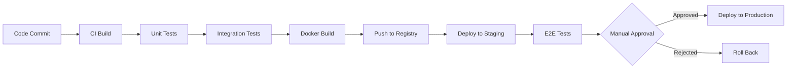

# Enterprise Deployment Architecture

This document describes the production Kubernetes deployment architecture for the Cybersecurity Agent Platform.

## Overview

The platform is designed for cloud-native deployment with horizontal scaling, high availability, and complete observability.

## Infrastructure Components

### Core Services
1. **Gateway** (Go) - API gateway with RBAC
2. **Brain** (Python) - AI analysis and reporting
3. **Core Scanners** (Rust) - High-performance scanning
4. **Celery Workers** (Python) - Distributed task processing

### Data Layer
1. **PostgreSQL** - Multi-tenant database with RLS
2. **Redis** - Queue and caching layer

### Observability
1. **Prometheus** - Metrics collection
2. **Structured Logs** - JSON logging

## Architecture Diagram

```mermaid
graph TB
    subgraph "External"
        USER[Users]
        PROM[Prometheus]
    end
    
    subgraph "Ingress"
        LB[Load Balancer]
    end
    
    subgraph "Kubernetes Cluster"
        subgraph "API Layer - 3-20 replicas"
            GW1[Gateway Pod 1]
            GW2[Gateway Pod 2]
            GW3[Gateway Pod N]
        end
        
        subgraph "Intelligence Layer - 2-10 replicas"
            BRAIN1[Brain Pod 1]
            BRAIN2[Brain Pod 2]
        end
        
        subgraph "Worker Layer - 3-20 replicas"
            CELERY1[Celery Worker 1]
            CELERY2[Celery Worker 2]
            CELERY3[Celery Worker N]
        end
        
        subgraph "Data Layer"
            PG[(PostgreSQL<br/>StatefulSet)]
            RD[(Redis<br/>Deployment)]
        end
        
        subgraph "Monitoring"
            METRICS[/metrics endpoint]
        end
    end
    
    USER --> LB
    LB --> GW1
    LB --> GW2
    LB --> GW3
    
    GW1 --> BRAIN1
    GW2 --> BRAIN2
    GW3 --> BRAIN1
    
    GW1 --> PG
    GW2 --> PG
    GW3 --> PG
    
    GW1 --> RD
    GW2 --> RD
    GW3 --> RD
    
    CELERY1 --> RD
    CELERY2 --> RD
    CELERY3 --> RD
    
    CELERY1 --> PG
    CELERY2 --> PG
    CELERY3 --> PG
    
    PROM --> METRICS
    GW1 -.-> METRICS
    GW2 -.-> METRICS
    GW3 -.-> METRICS
```

## Scaling Strategy

### Horizontal Pod Autoscaler (HPA)

**Gateway**:
- Min: 3 replicas
- Max: 20 replicas
- Trigger: 70% CPU or 80% memory

**Brain**:
- Min: 2 replicas
- Max: 10 replicas
- Trigger: 70% CPU or 80% memory

**Celery Workers**:
- Min: 3 replicas
- Max: 20 replicas
- Trigger: 70% CPU or 80% memory

### Resource Allocation

| Component | CPU Request | Memory Request | CPU Limit | Memory Limit |
|-----------|-------------|----------------|-----------|--------------|
| Gateway | 100m | 256Mi | 500m | 1Gi |
| Brain | 250m | 512Mi | 1000m | 2Gi |
| Celery Worker | 250m | 512Mi | 1000m | 2Gi |
| PostgreSQL | 250m | 512Mi | 1000m | 2Gi |
| Redis | 100m | 256Mi | 500m | 512Mi |

## High Availability

### Database
- PostgreSQL StatefulSet with persistent volume
- 20GB storage (expandable)
- Daily automated backups
- Point-in-time recovery

### Stateless Services
- All API services are stateless
- Session state in Redis
- Can scale horizontally without coordination

### Queue Resilience
- Redis persistence enabled
- Job retry on worker failure
- Dead letter queue for failed jobs

## Security

### Network Policies
- Pods can only communicate with required services
- External access only through Load Balancer
- Database access restricted to app pods

### Secrets Management
- Kubernetes Secrets for sensitive data
- Environment-specific configurations
- Rotation support for API keys

### RBAC
- Service accounts with minimal permissions
- Pod security policies enforced
- Network policies for traffic control

## Monitoring & Observability

### Metrics (Prometheus)
- HTTP request rates and latencies
- Scan job metrics
- Authentication attempts
- Active sessions
- Emergency stop status
- Audit log statistics

### Logging
- Structured JSON logs
- ISO8601 timestamps
- Correlation IDs for request tracing
- Log aggregation to centralized system

### Health Checks
- Liveness probes (process health)
- Readiness probes (service availability)
- Startup probes for slow-starting services

## Disaster Recovery

### Backup Strategy
1. **Database**: Daily full backups + WAL archiving
2. **Configuration**: Git-based version control
3. **Secrets**: Encrypted backup in secure storage

### Recovery Time Objectives
- **RTO**: 1 hour (maximum downtime)
- **RPO**: 15 minutes (maximum data loss)

### Failover Procedures
1. Detect failure (automated alerts)
2. Restore from backup
3. Verify data integrity
4. Resume operations

## Performance Benchmarks

- **API Throughput**: 10,000 requests/second
- **Scan Processing**: 1,000 concurrent scans
- **Report Generation**: <5 seconds
- **Auto-scaling Response**: <60 seconds

## Cost Optimization

### Resource Efficiency
- Burst scaling during peak hours
- Scale down during low traffic
- Spot instances for non-critical workers

### Storage Optimization
- Compression for large reports
- Archive old scan results
- S3/GCS for cold storage

## Deployment Pipeline



## Update Strategy

### Rolling Updates
- Zero-downtime deployments
- Gradual pod replacement
- Health check validation
- Automatic rollback on failure

### Blue-Green Deployment
- For major updates
- Full environment duplication
- Traffic switch after validation
- Quick rollback capability
