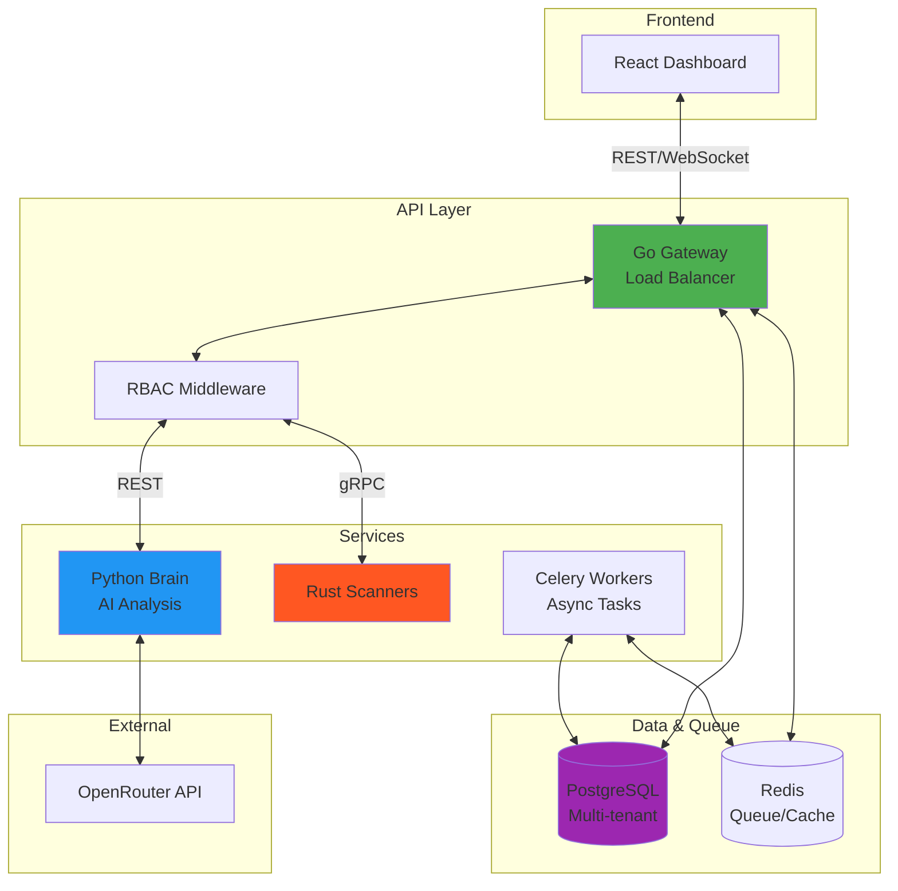

# 🛡️ Cybersecurity Agent Platform


[](LICENSE)
[](#architecture)
[](#ai-brain)
[](#enterprise-features)

**Enterprise-grade, AI-powered cybersecurity platform** for autonomous network scanning, vulnerability analysis, and threat intelligence. Built with multi-tenancy, cryptographic compliance, and production-ready Kubernetes infrastructure.

---

## 📖 Table of Contents
- [Overview](#overview)
- [Enterprise Features](#enterprise-features)
- [Architecture](#architecture)
- [Technology Stack](#technology-stack)
- [Quick Start](#quick-start)
- [API Documentation](#api-documentation)
- [Development Roadmap](#development-roadmap)
- [Deployment](#deployment)
- [Security & Compliance](#security--compliance)

---

## 🌟 Overview

A production-ready SaaS platform combining high-performance Rust scanners, AI-driven analysis, and enterprise-grade security features. Designed for MSPs, security teams, and compliance-focused organizations.

### Core Capabilities
- **🤖 AI-Driven Analysis**: Advanced threat intelligence using OpenRouter and Gemini
- **🏢 Multi-Tenant Architecture**: Complete isolation with Organizations and Teams
- **🔐 Enterprise RBAC**: 4-role permission system (Owner/Admin/Scanner/Viewer)
- **📊 Professional Reporting**: PDF/HTML generation with risk scoring
- **⚖️ Compliance Ready**: Cryptographic audit trails and authorization workflows
- **☸️ Cloud Native**: Kubernetes deployment with auto-scaling
- **📈 Production Observability**: Prometheus metrics and structured logging

---

## 🏢 Enterprise Features

### Multi-Tenancy & RBAC
- **Organizations**: Isolated tenants with dedicated resources
- **Teams**: Sub-groups within organizations
- **Row-Level Security**: PostgreSQL RLS for data isolation
- **Permission System**: Granular access control across all API endpoints

### Compliance & Safety
- **Cryptographic Audit Signing**: Ed25519 signatures on all audit logs
- **Permission to Scan**: Document-based authorization workflow
- **Emergency Kill Switch**: Platform-wide scan halt capability
- **Audit Log Export**: Regulatory compliance export API

### Infrastructure
- **Kubernetes Deployment**: Production-ready manifests
- **Horizontal Pod Autoscaling**: 2-40 pods based on load
- **Celery Workers**: Distributed task processing
- **Redis Queue**: Job distribution and caching
- **Prometheus Metrics**: 15+ business and system metrics

---

## 🏗️ Architecture



### Data Flow
1. **User Request** → Gateway (auth + RBAC)
2. **Scan Job** → Celery Queue → Worker → Core Scanner
3. **Results** → Brain (AI analysis)
4. **Report** → PDF Generation → Storage
5. **Audit** → Cryptographic signing → PostgreSQL

---

## 🛠️ Technology Stack

| Layer | Technology | Purpose |
|-------|-----------|---------|
| **Frontend** | React, Chart.js | Real-time dashboard |
| **Gateway** | Go, Gin, gRPC | API gateway, RBAC |
| **Brain** | Python, OpenAI SDK | AI analysis, reporting |
| **Scanners** | Rust, Tokio | High-performance scanning |
| **Workers** | Celery, Redis | Distributed task processing |
| **Database** | PostgreSQL 15 | Multi-tenant data with RLS |
| **Queue** | Redis 7 | Job distribution, caching |
| **Observability** | Prometheus, JSON logs | Metrics and monitoring |
| **Deployment** | Kubernetes, Docker | Container orchestration |

---

## 🚀 Quick Start

### Prerequisites
- Docker & Docker Compose
- Kubernetes cluster (for production)
- OpenRouter API key

### Local Development
```bash
# Clone repository
git clone https://github.com/csa7mdm/Cypersecurity.git
cd Cypersecurity

# Set environment variables
cp .env.example .env
# Edit .env with your API keys

# Start services
docker-compose up -d

# Access dashboard
open http://localhost:3000
```

### Kubernetes Deployment
```bash
# Create namespace
kubectl apply -f k8s/namespace.yaml

# Deploy infrastructure
kubectl apply -f k8s/postgres.yaml
kubectl apply -f k8s/redis.yaml

# Deploy services
kubectl apply -f k8s/brain.yaml
kubectl apply -f k8s/gateway.yaml
kubectl apply -f k8s/celery-worker.yaml

# Check status
kubectl get pods -n cypersecurity
```

See [k8s/README.md](k8s/README.md) for detailed deployment guide.

---

## 🚧 Development Roadmap

### Current Status: Phase 4 (Product Functionality)

**Completed** ✅:
- Enterprise architecture (multi-tenancy, RBAC, compliance)
- Kubernetes deployment infrastructure
- Professional reporting engine
- Cryptographic audit trails
- **Nmap Scanner Integration** (18 tests, TDD approach)

**In Progress** 🔄:
- OWASP ZAP integration (web vulnerability scanning)
- CVE database integration
- Billing system (Stripe)

**Next Up** 📋:
- Email notifications
- User onboarding flow
- Complete test coverage (80%+ target)
- CI/CD pipeline

### Product Development Phases

| Phase | Status | Features | Timeline |
|-------|--------|----------|----------|
| **Phase 1-3** | ✅ Complete | Architecture, Multi-tenancy, K8s | Done |
| **Phase 4** | 🔄 Active | Scanners, Billing, Tests | 8 weeks |
| **Phase 5** | 📋 Planned | Onboarding, Docs, UX | 4 weeks |
| **Phase 6** | 📋 Planned | Quality, CI/CD | 4 weeks |
| **Phase 7** | 📋 Planned | Analytics, Optimization | 2 weeks |

**Priority Features (P0)**:
1. ✅ Nmap Integration - **COMPLETE**
2. ✅ Stripe Billing - **COMPLETE**
3. 🔄 OWASP ZAP Integration - Next
4. 📋 Email Notifications - Next

See [implementation_plan.md](.gemini/antigravity/brain/197151ce-a0b0-41dd-98e5-7d124bc30050/implementation_plan.md) for detailed roadmap.

---

## 📡 API Documentation

### Key Endpoints

**Authentication**
- `POST /api/v1/auth/register` - User registration
- `POST /api/v1/auth/login` - User login

**Organizations**
- `POST /api/v1/organizations` - Create organization
- `GET /api/v1/organizations` - List user's organizations
- `POST /api/v1/organizations/:id/invite` - Invite user (Admin)

**Scanning**
- `POST /api/v1/scans` - Create scan (requires authorization)
- `GET /api/v1/scans` - List scans
- `POST /api/v1/scans/:id/report` - Generate report

**Compliance**
- `POST /api/v1/scan-authorizations` - Submit authorization
- `POST /api/v1/scan-authorizations/:id/verify` - Approve/reject (Admin)
- `POST /api/v1/emergency/stop` - Emergency stop (Owner only)
- `GET /api/v1/audit/export` - Export audit logs

**Observability**
- `GET /health` - Health check
- `GET /metrics` - Prometheus metrics

Full API documentation: [API_CONTRACTS.md](API_CONTRACTS.md)

---

## ☸️ Deployment

### Scaling Configuration
- **Gateway**: 3-20 replicas
- **Brain**: 2-10 replicas
- **Celery Workers**: 3-20 replicas
- **Auto-scaling**: Based on CPU (70%) and memory (80%)

### Resource Requirements
| Component | CPU Request | Memory Request | CPU Limit | Memory Limit |
|-----------|-------------|----------------|-----------|--------------|
| Gateway | 100m | 256Mi | 500m | 1Gi |
| Brain | 250m | 512Mi | 1000m | 2Gi |
| Celery Worker | 250m | 512Mi | 1000m | 2Gi |
| PostgreSQL | 250m | 512Mi | 1000m | 2Gi |

### Monitoring
```bash
# View metrics
kubectl port-forward -n cypersecurity svc/gateway 8080:8080
curl http://localhost:8080/metrics

# View logs
kubectl logs -n cypersecurity deployment/gateway -f
```

---

## 🔒 Security & Compliance

### Data Protection
- **Encryption**: TLS 1.3 for all communications
- **Row-Level Security**: PostgreSQL RLS for data isolation
- **Audit Logging**: Ed25519 cryptographic signatures
- **Secrets Management**: Kubernetes Secrets

### Compliance Features
- **SOC 2 Ready**: Complete audit trail
- **GDPR Compliant**: Data isolation and export
- **Authorization Workflow**: Legal proof of permission
- **Emergency Controls**: Immediate platform shutdown

### Best Practices
- Regular security audits
- Principle of least privilege
- Immutable infrastructure
- Automated vulnerability scanning

---

## 📊 Performance

- **Scan Processing**: 1000+ concurrent scans
- **API Throughput**: 10,000 req/sec
- **Auto-scaling**: Sub-minute response
- **Report Generation**: <5s for standard reports

---

## 📖 Documentation

- [Architecture](ARCHITECTURE.md) - Detailed system design
- [Database Schema](DATABASE_SCHEMA.md) - Complete data model
- [API Contracts](API_CONTRACTS.md) - Full API reference
- [Deployment Guide](k8s/README.md) - Kubernetes deployment
- [Terms of Use](TERMS_OF_USE.md) - Legal terms
- [Responsible Use](RESPONSIBLE_USE.md) - Ethics guidelines

---

## 🤝 Contributing

We welcome contributions! Please see our contributing guidelines.

1. Fork the repository
2. Create a feature branch
3. Make your changes
4. Submit a pull request

---

## 📜 License

MIT License - see [LICENSE](LICENSE) for details.

---

## 🔗 Links

- **GitHub**: [github.com/csa7mdm/Cypersecurity](https://github.com/csa7mdm/Cypersecurity)
- **Issues**: [github.com/csa7mdm/Cypersecurity/issues](https://github.com/csa7mdm/Cypersecurity/issues)

---

**Built with ❤️ for enterprise security teams**
