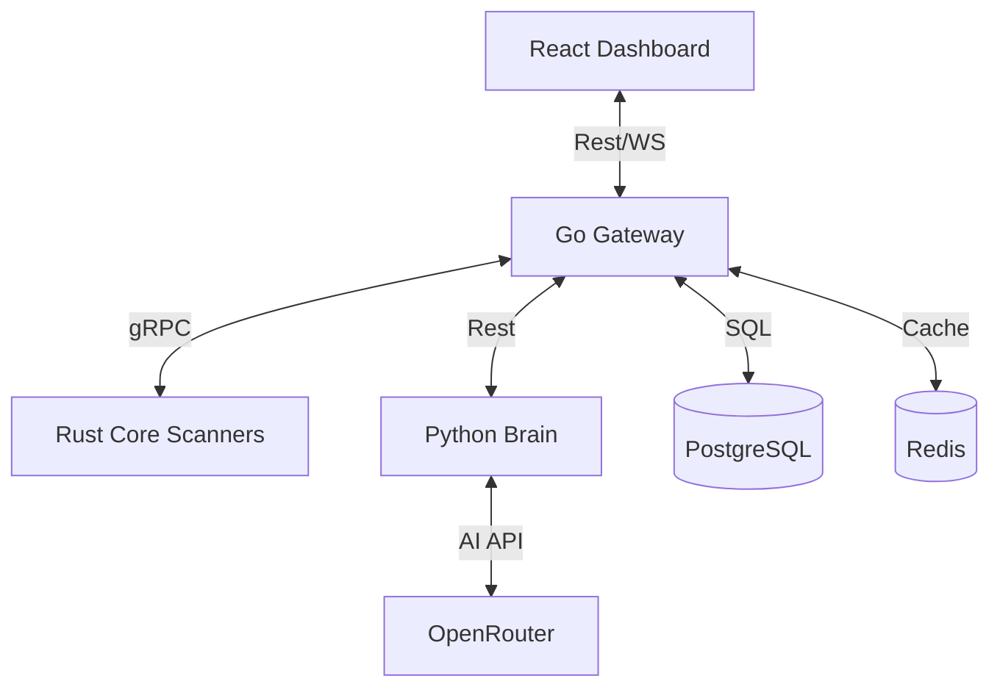

# 🛡️ Cybersecurity Agent Platform


[](LICENSE)
[](#architecture)
[](#ai-agentic-brain)

A state-of-the-art, polyglot cybersecurity platform designed for autonomous network scanning, vulnerability analysis, and remediation orchestration. Built with a focus on security, performance, and agentic intelligence.

---

## 📖 Table of Contents
- [Overview](#overview)
- [Architecture](#architecture)
- [Technology Stack](#technology-stack)
- [Project Structure](#project-structure)
- [AI Agentic Brain](#ai-agentic-brain)
- [Development Guide](#development-guide)
- [Security & Compliance](#security--compliance)
- [Deployment](#deployment)
- [Contributing](#contributing)

---

## 🌟 Overview

The Cybersecurity Agent Platform is an end-to-end solution for security scanning and threat assessment. It leverages a decentralized architecture to perform deep protocol analysis across WiFi, Bluetooth, and IP-based networks, providing real-time intelligence to a central "Brain" for decision-making.

### Key Features
- **Autonomous Scan Planning**: AI-driven scan orchestration based on target profile.
- **Polyglot Collectors**: High-performance scanners written in Rust for low-level protocol access.
- **Agentic Intelligence**: Python-based Brain utilizing OpenRouter for advanced reasoning.
- **Scalable Gateway**: Go-based API gateway with gRPC and REST support.
- **Real-time Dashboard**: Modern React frontend for live visualization of scan results.
- **Security Guardrails**: Built-in kill switch and user-confirmation requirements for risky actions.

---

## 🏗️ Architecture

The platform follows a modular, distributed architecture designed for maximum isolation and performance.



### Data Flow (Scan Lifecycle)
1. **Request**: User triggers a scan via the Dashboard.
2. **Planning**: Gateway requests a plan from the **Brain**.
3. **Execution**: Gateway orchestrates **Core Scanners** via gRPC.
4. **Analysis**: Results are streamed back to the Gateway and analyzed by the **Brain**.
5. **Visualization**: Findings are updated in real-time on the **Dashboard**.

---

## 🛠️ Technology Stack

| Layer | Technology | Rationale |
|---|---|---|
| **Core Scanners** | Rust | Memory safety and high performance for packet inspection. |
| **Brain** | Python / OpenAI SDK | Extensive AI ecosystem and rapid iteration. |
| **Gateway** | Go | Superior concurrency and gRPC performance. |
| **Dashboard** | React / Vite | Modern, responsive UI with state management. |
| **Database** | PostgreSQL | Robust relational storage with JSONB support. |
| **Messaging** | Redis / gRPC | High-throughput async communication. |

---

## 📂 Project Structure

```bash
Cypersecurity/
├── brain/             # AI reasoning engine (Python)
├── core/              # Low-level scanners (Rust)
├── gateway/           # Central API & orchestration (Go)
├── dashboard/         # Web interface (React/TS)
├── database/          # SQL migrations & schema
├── scripts/           # Automation & setup utilities
├── vscode-extension/  # Developer tools
└── docs/              # Detailed technical documentation
```

---

## 🧠 AI Agentic Brain

The "Brain" is the intelligence layer of the platform. It is designed to work in tandem with other AI agents (like Antigravity).

### Capabilities for Agents:
- **Scan Planning**: `POST /api/v1/brain/plan` - Generates a multi-step scan strategy.
- **Results Analysis**: `POST /api/v1/brain/analyze` - Interprets raw scan data.
- **Interactive Assistance**: `GET /api/v1/brain/ask` - Real-time security Q&A.

> [!TIP]
> When interacting with this platform as an AI agent, prioritize the `brain` service for complex reasoning and the `gateway` for raw data access.

---

## 🚀 Development Guide

### Prerequisites
- **Rust**: 1.70+
- **Go**: 1.21+
- **Python**: 3.10+
- **Node.js**: 18+
- **Docker & Docker Compose**

### Quick Start
```bash
# 1. Clone the repository
git clone https://github.com/csa7mdm/Cypersecurity.git
cd Cypersecurity

# 2. Run the environment setup script
./scripts/setup.sh

# 3. Spin up infrastructure
docker-compose up -d database redis

# 4. Start the platform
./scripts/develop.sh
```

---

## 🛡️ Security & Compliance

This platform is built for ethical hacking and authorized research only. 

- **Audit Logging**: Every action is logged in a tamper-resistant PostgreSQL table.
- **Kill Switch**: A global emergency shutdown can be triggered via `POST /api/v1/emergency/stop`.
- **Confirmation Flow**: Hazardous operations (e.g., active deauth) require a secondary `confirm_token`.

Please refer to [RESPONSIBLE_USE.md](./RESPONSIBLE_USE.md) and [TERMS_OF_USE.md](./TERMS_OF_USE.md) before deployment.

---

## 🚢 Deployment

Detailed deployment guides are available in the [Docs](./docs) folder:
- [Docker Compose Deployment](./docs/DEPLOYMENT.md#docker-compose)
- [Kubernetes / Helm](./docs/DEPLOYMENT.md#kubernetes)

---

## 🤝 Contributing

We welcome contributions! Please see our [CONTRUBUTING.md](./docs/CONTRIBUTING.md) for details on:
- Coding standards (Clean Code, PEP 8, Go Fmt)
- Git workflow (Feature branching)
- Pull Request requirements

---

**Built with ❤️ by the Cybersecurity AI Team.**
